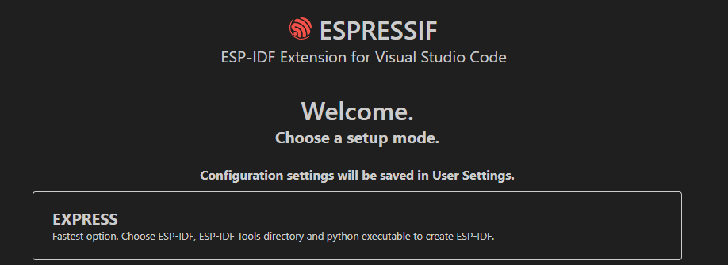
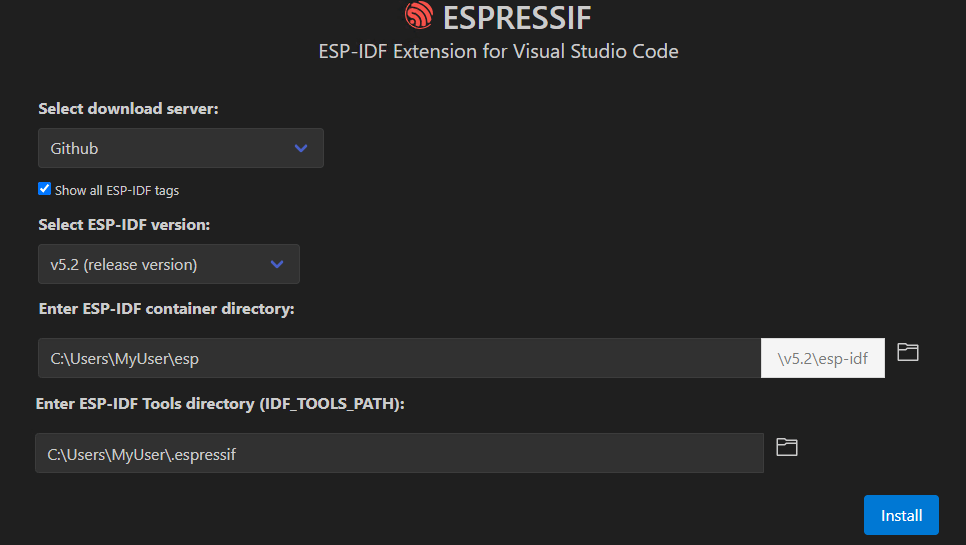

# Einrichtung der Entwicklungsumgebung

## 1. Visual Studio Code installieren
VSCode von der offiziellen Webseite herunterladen und installieren:
[https://code.visualstudio.com/download](https://code.visualstudio.com/download)

## 2. USB Treiber installieren
Der Treiber wird benötigt, damit Windows den ESP32 erkennt.

1. Silicon Labs `CP210x Windows Drivers` herunterladen:
[https://www.silabs.com/developers/usb-to-uart-bridge-vcp-drivers](https://www.silabs.com/developer-tools/usb-to-uart-bridge-vcp-drivers?tab=downloads#:~:text=9/3/2020-,CP210x%20Windows%20Drivers,-v6.7.6)
2. Heruntergeladenes Archiv `CP210x_Windows_Drivers.zip` entpacken
3. Den Treiber durch Ausführen von `CP210xVCPInstaller_x64.exe` installieren

## 3. Visual C++ Redistributable installieren
Das Visual C++ Redistributable wird zum Kompilieren des Projekts benötigt.

1. Die neueste Version des Visual C++ Redistributable Packages von der Microsoft-Website herunterladen:
[https://learn.microsoft.com/de-de/cpp/windows/latest-supported-vc-redist](https://learn.microsoft.com/de-de/cpp/windows/latest-supported-vc-redist?view=msvc-170#latest-microsoft-visual-c-redistributable-version:~:text=unterst%C3%BCtzte%20x86%2DVersion-,X64,-https%3A//aka.ms)
2. Die heruntergeladene Datei ausführen und den Anweisungen folgen, um die Installation abzuschließen.

## 4. ESP-IDF Erweiterung installieren
1. VSCode öffnen
2. Die **Erweiterungen** Ansicht öffnen:
   - Über das Erweiterungen-Symbol  in der Seitenleiste oder
   - Mit der Tastenkombination `Ctrl + Shift + X`
3. Im Suchfeld `espressif.esp-idf-extension` eingeben
4. Das erste Suchergebnis **ESP-IDF** über "Install" installieren

Alternativ kann die Erweiterung auch direkt über den Visual Studio Marketplace installiert werden:
[ESP-IDF](https://marketplace.visualstudio.com/items?itemName=espressif.esp-idf-extension)

## 5. ESP-IDF Erweiterung einrichten
Nach der Installation muss die Erweiterung noch konfiguriert werden

1. ESP-IDF Explorer öffnen: In VSCode `F1` drücken, `ESP-IDF: Configure ESP-IDF Extension` eingeben und auswählen

2. Setup Mode **Express** auswählen
3. 

4. Checkbox **Show all ESP-IDF tags** aktivieren
5. Bei **Select ESP-IDF version** die Version **v5.2 (release version)** auswählen
6. Auf "Install" klicken und die Installation abwarten (ca. 10 Minuten)

`Stand: Visual Studio Code Version 1.95.3, ESP-IDF Erweiterung Version 1.9.0, Visual C++ Redistributable 14.42.34433.0`
